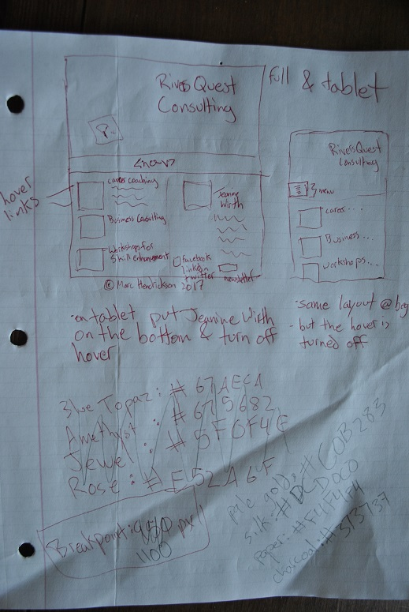
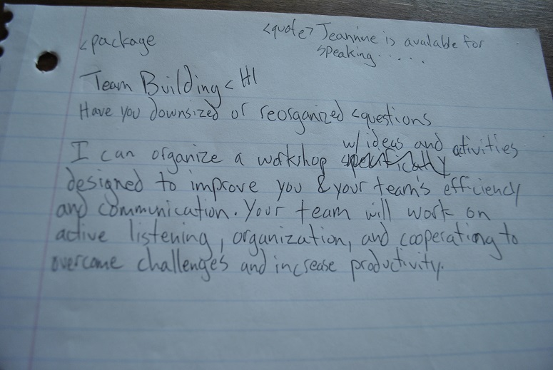
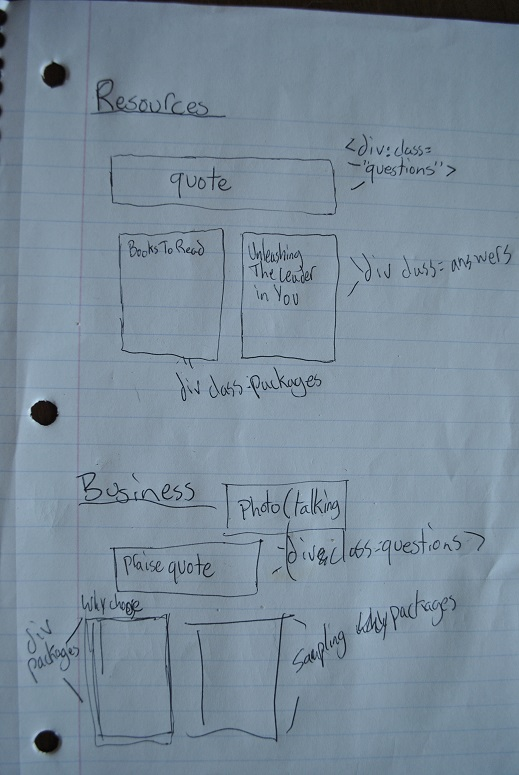

# Marc Hendrickson
### MART 341 Final

---

This is an example of one of my layouts for the initial homepage.

This was one of my last pages that I laid out so I already knew which classes I was going to put where it was just a matter of writing the content.

This is how I laid out all of the other pages, I found it much easier to draw them out on paper instead of using an internet source.

### Work

For the final assignment I chose to work on remaking an actual website for an Engineering Firm in Bigfork, MT. I am happy with it enough to hand in. However, I am going to take JavaScript classes this summer so I will continue to work on it to make it look as professional as possible. I chose not to include an actual gallery on my final assignment because I do not think that this web page would benefit from one so I am sorry about not following the directions exactly. Working on the final assignment really made me feel like I am getting to know how to write code, and it is getting me excited to further my education in this field.
